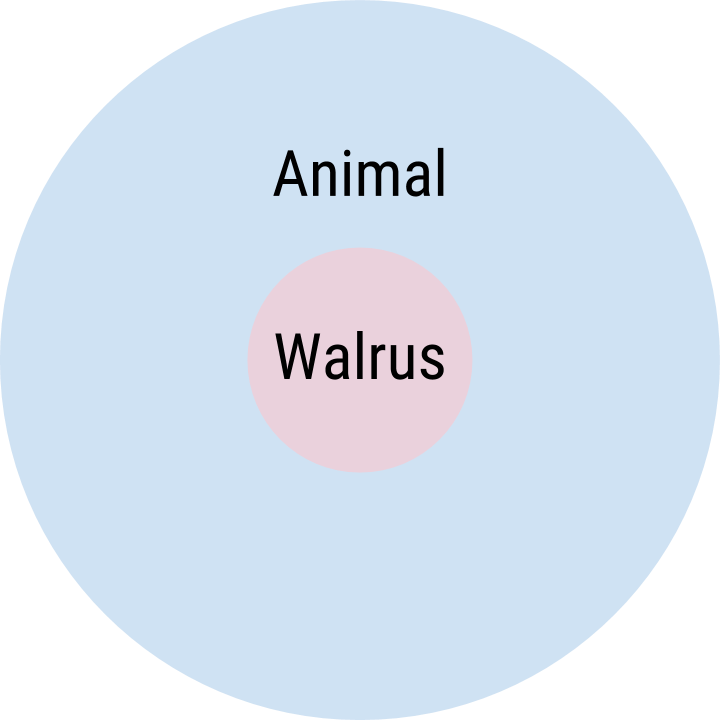
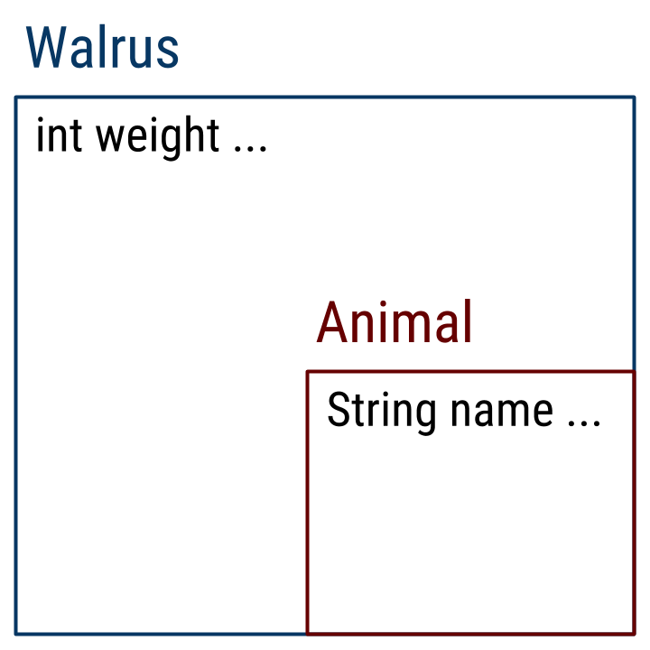

Things I wish I knew when I was learning Java in CS 61B.

## Environment

In Java, **variables** are declared. Unlike **names** in Python, variables in Java obey special lookup rules depending on the context of the program. For example, consider the following code snippet.

    public class Walrus {
        public int weight = 3500;

        public void consumeFood(int weight) {
            System.out.println("Yummy, just ate " + weight + " pounds of food!");
        }
    }

In this program, there are two different variables with the name, `weight`. Which variable is chosen depends on the context. Loosely speaking, the rule that Java obeys for variable lookup is as follows:

 1. Look in the local scope.
 2. Look in the instance and class.
 3. Look in the superclass. (More on this later.)

There are, however, ways to specify preference. Suppose I want to refer to the Walrus object's current weight in the `consumeFood` method rather than the weight that was passed in. We can specify `this.weight` to start the lookup procedure from step 2 rather than step 1.

    public class Walrus {
        public int weight = 3500;

        public void consumeFood(int weight) {
            System.out.println("Yummy, just ate " + weight + " pounds of food!");
            this.weight = this.weight + weight;
            System.out.println("My new total weight is " + this.weight + " pounds.");
        }
    }

This is particularly useful when defining constructors.

    public class Walrus {
        public int weight;

        public Walrus(int weight) {
            this.weight = weight;
        }
    }

### Variable scope

A special note about C-style languages is that variables are not only declared before assignment, but that variables have scope, or a limited region in which the variable is valid. Consider the following program.

    public class Magic {
        public static void main(String[] args) {
            int magic = 42;
            System.out.println(magic);
        }

        public static void makeMagicHappen() {
            System.out.println("This is so magical!");
            System.out.println(magic);
        }
    }

There's a compile-time error here because the scope of the variable `magic` is only within the main method. The rule for variable scope, however, is also present within a method as well. The commented lines below indicate statements that would cause compile-time errors because of the rules for variable scope.

    public class Magic {
        public static void main(String[] args) {
            int magic = 42;
            if (magic == 42) {
                double G = 6.67E-11;
                System.out.println("Science is cool! " + G);
            }
            for (int i = 1; i < magic; i = i * 2) {
                System.out.println("We're " + (magic - i) + " away from magic!");
                // System.out.println(G);
            }
            // System.out.println(i);
        }
    }

Generally, a variable's scope is limited to within its enclosing braces: the variable `G` declared within the if block is valid only within the if block. It's also possible to declare another variable `G` as long as its scope does not conflict with any other already-declared variable.

    public class Magic {
        public static void main(String[] args) {
            int magic = 42;
            if (magic == 42) {
                double G = 6.67E+11;
                System.out.println("Science is cool! " + G);
            }
            if (magic == 42) {
                boolean G = true;
                System.out.println("Science is cool! " + G);
            }
        }
    }

## Functions are no longer first class

In Python, we treat functions themselves as proper values: for example, we can pass them around as inputs to other functions and define higher-order functions.

    def square(x):
    return x * x

    print(square)
    # <function square at 0x7f...>
    print(map(square, [1, 2, 3]))
    # [1, 4, 9]

However, Java's model of the universe is organized around objects whose functionality is defined by **methods**. Functions, or *methods*, themselves cannot exist on their own: a method in Java only makes sense as a member of its enclosing object. While in Python, we could easily pass the square function to the map procedure, the same isn't true in Java. (Note: Not exactly true in Java 8.)

    public class AntonSquaredMe {
        public static int square(int x) {
            return x * x;
        }
        public static void main(String[] args) {
            // System.out.println(square);
            System.out.println(square(4));
        }
    }

To work around this, we can design [function objects](https://en.wikipedia.org/wiki/Function_object#In_Java) that implement an interface. More on this later when we learn about abstract classes and interfaces.

## Compilation and containers

Java is a **statically-typed** language, meaning that the type of each variable must be known at compile-time. However, this presents a problem when we want to write general code: it can be redundant to have to rewrite code tailored to each specific object, especially if the objects share some common features. For example, if we were to be extremely strict about our types, the following operation would not be allowed because there is an **implicit conversion** of the sum of the two integers, 3, to a double when assigning to the variable fun.

    public class Main {
        public static void main(String[] args) {
            double fun = 1 + 2;
        }
    }

Java makes many such convenience shortcuts like these for us: you can mix-and-match many numeric types in arithmetic expressions and Java will do its best to infer your intention.

While this works out nicely for primitive types, what about reference types? How can we promote code reuse when working with classes and objects? Java's answer to this question is to use "container" types: at compile time, we provide a **static type** which defines the subset of functionality needed by some object.

    public class Walrus {
        public int weight;

        public Walrus() {
            weight = 3500;
        }

        public void clap() {
            System.out.println("*CLAP* *CLAP *CLAP*");
        }

        public static void main(String[] args) {
            Walrus w = new Walrus();
            w.clap();
            System.out.println(w.weight);
        }
    }

### A short detour: the compiler's view

If we imagine ourselves as the Java compiler, for the `Walrus.main` method to work, three things must exist:

 - A Walrus class with a no-argument constructor.
 - A no-argument `Walrus.clap()` instance method. The return type doesn't matter in this case since the value is discarded anyways.
 - A field of any type: `Walrus.weight`.

As long as we satisfy these three constraints, every line in the main method *might be able to run*. One of the Java compiler's jobs is to ensure that these three items are defined and accessible. We refer to this compiler's view of the world with the term, **static**: the linkages and guarantees that must be satisfied by the compiler before the program even runs!

What can be very confusing about the term **static** is that, depending on the context, it can mean different things. Let's first work through the term **static type** and its twin, **dynamic type**.

### Static type

With our definition of static above, **static type** refers to the type used by the compiler to make its guarantees. The static type, Walrus, is given on the left of the equals sign.

    Walrus w = new Walrus();

Returning to the question of code reuse, one feature of Java is that the variable `w` can actually contain objects that are not Walruses. Suppose we wanted to implement another class that functions just like a Walrus:

    public class BabyWalrus {
        public int weight = 1000;

        public void clap() {
            System.out.println("*clap* *clap*");
        }
    }

The BabyWalrus class provides the same set of functionality as the Walrus class above. Yet substituting in the BabyWalrus will break the code, but for a different reason.

    // Walrus w = new BabyWalrus();

### Dynamic type

On the right side of the assignment, we've instantiated a new BabyWalrus as the value for `w`. The **dynamic type** of `w` is BabyWalrus. Here though, the problem is not with checking that Walrus satisfies all three requirements but rather that a BabyWalrus might not provide all the guarantees of a Walrus. The Java compiler isn't convinced: what if our definition of BabyWalrus didn't include a `void clap()` method, for instance? We can imagine a couple scenarios where the code wouldn't hold up. To assert that every BabyWalrus is a Walrus, and by extension, **claim that a BabyWalrus can do everything a Walrus can do**, use the `extends` keyword.

    public class BabyWalrus extends Walrus {
        ...
    }

This claims to the Java compiler that a BabyWalrus **is a** Walrus: that it has all the fields and functionality of Walrus. This is a strong claim to make, so in later sections we'll discuss the implications of this design choice.

### static keyword

So far, we've discussed what static means in terms of the type system. Confusingly, Java also uses the term **static** as a keyword in the syntax of the language itself. You've probably already seen the keyword `static` scattered around method and field declarations in almost every class file.

Here, static says to Java that a particular member is shared by the class and is not specific to any one particular instance or object.

    public class Walrus {
        public static int clapCount = 0;

        public void clap() {
            System.out.println("*CLAP* *CLAP* *CLAP*");
            Walrus.clapCount += 1;
        }
    }

Here, the `clapCount` variable is shared by the entire class of Walruses. In other words, it keeps track of the total number of claps amongst all Walruses.

When static is applied to a method declaration, it means that the method is not specific to any particular instance of the class. The additional implication here is that static methods can be invoked without first creating an object. There's no notion of `this`.

    public class Walrus {
        public static int clapCount = 0;

        public void clap() {
            System.out.println("*CLAP* *CLAP* *CLAP*");
            Walrus.clapCount += 1;
        }

        public static void printClapCount() {
            System.out.println("Walruses have clapped " + clapCount + " times!");
        }
    }

It's called static because the decision to link fields and methods are done at compile time and, consequently, are looked up against the static type of a variable rather than its dynamic type.

## Object Inheritance Model

What's most confusing about Java's inheritance model is that its abstract representation and implementation look totally different. Consider the following inheritance structure.

    public class Animal {
        public String name;
    }

    public class Walrus extends Animal {
        public int weight;
    }

We normally say that, "Walrus is a subclass of Animal," or, "Walrus is one type of Animal," or, "**Walrus is an Animal.**" The taxonomical view looks something like this.

In order to support the claim that every Walrus **is an** Animal, the way Java implements inheritance is by having an Animal underneath every Walrus. Imagine a box-and-pointer diagram that looks like this.

Walrus **is an** Animal because it contains all the fields and methods of the Animal class.

### Dynamic method lookup

To make inheritance truly useful, we need some way of performing different actions depending on the **dynamic type** of an object. Recall that our definitions of Walrus and BabyWalrus look something like this:

    public class Walrus {
        public int weight;

        public Walrus() {
            weight = 3500;
        }

        public void clap() {
            System.out.println("*CLAP* *CLAP *CLAP*");
        }

        public static void main(String[] args) {
            Walrus b = new BabyWalrus();
            b.clap();
        }
    }

    public class BabyWalrus extends Walrus {
        public void clap() {
            System.out.println("*clap* *clap*");
        }
    }

Java uses dynamic method lookup to allow us to write general code that performs different functions depending on the dynamic type of the Walrus.

    public static void main(String[] args) {
        Walrus[] walri = { new Walrus(), new BabyWalrus(), new Walrus() };
        for (Walrus w : walri) {
            w.clap();
        }
    }

Then, depending on the object's dynamic type, the specific overriding method is chosen. A method in a subclass overrides one in a superclass if the argument list is the same and the return type is the same or a subtype of the original method's return type. In the simple example above, `BabyWalrus.clap()` overrides `Walrus.clap()`.

### Static field lookup

TODO: Write this.

## Default Constructors

It's time for a throwback lesson! Hello, World, Again!

    public class HelloWorldAgain {
        public static void main(String[] args) {
            System.out.println("Hello, world!");
        }
    }

There's actually something quite mysterious lurking under the surface of this program. Did you notice that this class has no constructor? Even so, one of the first things we learned about objects is that the following code will work just fine even though there's no constructor defined in the class.

    public class HelloWorldAgain {
        public static void main(String[] args) {
            HelloWorldAgain wowie = new HelloWorldAgain();
        }
    }

This is the result of some Java magic: **if no constructors are provided, then a default, no-argument constructor is filled in by Java** that doesn't perform any additional variable initialization. The moment a constructor is defined, the default constructor is no longer provided.

    public class HelloWorldAgain {
        public HelloWorldAgain(String greeting) {
            System.out.println(greeting);
        }

        public static void main(String[] args) {
            // HelloWorldAgain wowie = new HelloWorldAgain();
            HelloWorldAgain magic = new HelloWorldAgain("Good morning, sun!");
        }
    }

In the example above, the first commented line does not compile because the no-argument constructor is no longer provided.

### Funky Implication: Implicit super() call

Recall that, in Java's object inheritance model, all Walruses are also Animals.

How does that actually happen? There's one last bit of magic that glues everything together. To realize the Animal in every Walrus, the default constructor actually performs an implict `super()` call to fill the Animal fields. This is what it looks like.

    public class Animal {
        public String name;

        public Animal() {
            name = "Generic animal";
        }
    }

    public class Walrus extends Animal {
        public Walrus() {
            // super();
        }
    }

Whether you include the commented line or not doesn't make a difference: the default constructor for Walrus automatically calls super() to guarantee that the Walrus really is an Animal. Without it, the Animal.name field would not contain the correct value.

The problem with this arises if we wish to extend a class that does not provide the no-argument constructor. Suppose we're working on extending NBody with some additional planetary types.

    public class Planet {
        public Planet(double xP, double yP, double xV,
                      double yV, double m, String img) {
            ...
        }
    }

    /** Probably not astronomically correct! */
    public class AntimatterPlanet extends Planet {
        public AntimatterPlanet() {
            System.out.println("We no longer matter anymore!");
        }
    }

This code actually doesn't work! Remember the implicit super call really defines the body of AntimatterPlanet's constructor as:

    public class AntimatterPlanet extends Planet {
        public AntimatterPlanet() {
            super();
            System.out.println("We no longer matter anymore!");
        }
    }

However, the no-argument constructor doesn't exist in the Planet class! What we can do to fix this issue is to help Java out and provide a super-constructor call.

    public class AntimatterPlanet extends Planet {
        public AntimatterPlanet() {
            super(0.0, 0.0, 0.0, 0.0, 0.0, "images/nothing.png");
            System.out.println("We kinda matter now... it's complicated.");
        }
    }

Since the super call is provided, Java will use it to initialize the Planet object rather than the implicit, no-argument super call.

## Overloading

In Python, we can define default parameter values.

    class Link:
        empty = ()

        def __init__(self, first, rest=empty):
            self.first = first
            self.rest = rest

We can achieve the same in Java with method overloading. **Two methods can share the same name as long as their input parameters are not the same.** This works with constructors as well, which lets us design a nice syntax for creating IntLists.

    public class IntList {
        public int first;
        public IntList rest;

        public IntList(int first) {
            this(first, null);
        }

        public IntList(int first, IntList rest) {
            this.first = first;
            this.rest = rest;
        }
    }

One way of keeping code compact when using overloading is to first define the most general version of a function. In the example above, the second constructor `IntList(int first, IntList rest)` will initialize all the fields while the first constructor only initializes the first field. We can call the second constructor with a null argument for the rest to reuse the code.
